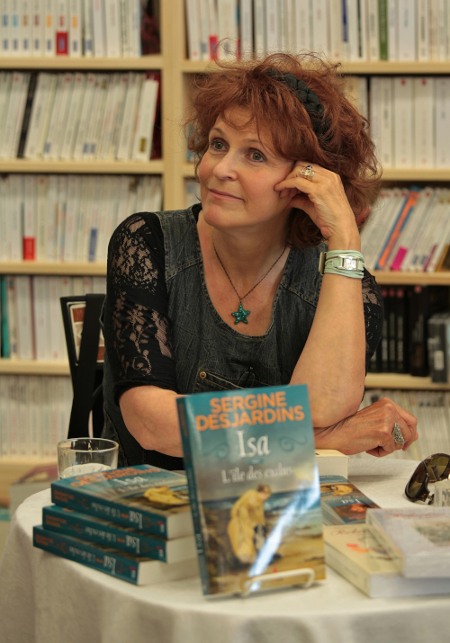

   
  Crédit photo : Michel Dompierre.

Ayant quitté l'école à l'âge de 16 ans, j'ai pratiqué divers métiers avant de retourner aux études et de compléter une maîtrise en éthique.

J'ai ensuite été assistante de recherche, puis j'ai fondé et dirigé un organisme de parrainage pour les jeunes. À titre de pigiste, j'ai rédigé plusieurs articles pour divers magazines, ainsi que pour un quotidien. J'ai aussi écrit des biographies familiales et collaboré à deux ouvrages collectifs, *Perspectives éthiques sur la condition des femmes* et *Chaperon Blues*. Je suis aussi l'auteure d'un essai, *Médecins & Sages-femmes. Les enjeux d'un débat qui n'en finit plus*.

Mon premier roman, *Marie Major*, est inspiré de la vie de mon ancêtre, une Fille du roi dont l'époux, Antoine Roy dit Desjardins, a été assassiné dans le lit de sa maîtresse. Réimprimé 4 fois par Guy Saint-Jean éditeur, les droits ont aussi été achetés par Québec/Loisirs, France/Loisirs et Pocket. Ce roman a été couronné du [prix littéraire international indépendant Marguerite Yourcenar 2013](http://ici.radio-canada.ca/nouvelles/arts_et_spectacles/2013/08/14/001-sergine-desjardins-recoit-un-prix-litteraire.shtml) décerné par l'agence littéraire italienne Punctum.

J'ai ensuite écrit la biographie de Robertine Barry, première femme journaliste
canadienne-française. Cette bio en deux tomes m'a mérité le Prix Jovette
Bernier 2011. Cette même année, j'étais l'une des invités d'honneur du Salon du
livre de Rimouski. Ces deux livres n’étant plus disponibles en librairie, je
peux cependant les poster. Plus de 10 ans après leur publication, ces livres
n’étaient plus disponibles en librairie. J’ai donc mis à jour les deux tomes et
les ai auto-édités. Les versions papier et numérique se trouvent sur amazon ([tome 1](https://www.amazon.ca/-/fr/Sergine-Desjardins-ebook/dp/B08FF456RF/ref=sr_1_1?__mk_fr_CA=%C3%85M%C3%85%C5%BD%C3%95%C3%91&crid=1O1VA2H25J05&dchild=1&keywords=robertine+barry+tome+1&qid=1598537092&sprefix=Robertine+Barry%2Caps%2C144&sr=8-1) et [tome 2](https://www.amazon.ca/-/fr/Sergine-Desjardins-ebook/dp/B08FL86DHW/ref=sr_1_1?__mk_fr_CA=%C3%85M%C3%85%C5%BD%C3%95%C3%91&dchild=1&keywords=robertine+barry+tome+2&qid=1598537119&sr=8-1)).

En 2012, je fus l'une des vingt auteurs choisis par l'UNEQ et l'ACFAS pour
rédiger un texte poétique inspiré d'une recherche scientifique. La même année,
j'ai reçu une bourse du Conseil des arts du Québec afin d'écrire mon diptyque
Isa. Les deux tomes de ce roman, dont la toile de fond est l'épidémie de lèpre
au Nouveau-Brunswick, ont été au palmarès Gaspard pendant huit semaines.

En 2014, j'étais finaliste pour le Prix Artiste de la ville de Rimouski avant d'être, en 2015, récipiendaire de ce prix.

En 2016, a été publié dans l'Encyclopédie canadienne mon article sur Robertine Barry et un autre sera publié dans le Petit dictionnaire des grandes québécoises d'hier et d'aujourd'hui.

Le châtiment de Clara, roman historique lancé au Québec en avril 2017, raconte l'histoire d'une femme victime d'un viol au 17e siècle.

En 2019, à l’occasion du 50e anniversaire de l’UQAR, j’ai l’honneur de faire
partie des 50 diplômés qui se sont le plus illustrés après leur passage à cette
université.

En 2021, a été lancé le recueil de nouvelles auquel j’ai eu l’immense bonheur de collaborer. Le titre : Des nouvelles de maman.

J'offre une série de conférences dont les titres sont : 1. Marie Major et son époque. 2. Les Filles du Roy. 3. Robertine Barry et son époque. 4. Tracadie au temps de la lèpre. 5. Viol et violence faite aux femmes au 17e siècle. 6. Cinq femmes : Marie Major (1637-1689), Robertine Barry (1863-1910), Rosalie Cadron-Jetté (1764-1864), Clara de Longueville et Geneviève Picoté dit Belestre (1667-1721).
