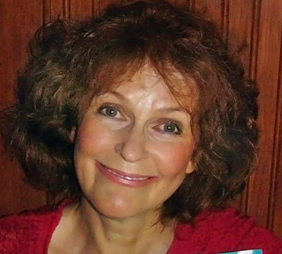

Détentrice d’une maîtrise ès arts (Éthique), Sergine Desjardins a collaboré à
deux ouvrages et publié, en 1993, un essai, Médecins & Sages-femmes. Les enjeux
d’un débat qui n’en finit plus. Avant de consacrer tout son temps à l’écriture,
elle a notamment été assistante de recherches, a fondé un organisme venant en
aide aux jeunes et a exercé le métier de journaliste pigiste.

Son premier roman, Marie Major, est inspiré de son ancêtre, une fille du roi
dont l’époux, Antoine Roy dit Desjardins, a été assassiné dans le lit de sa
maîtresse. Ce roman historique a inspiré un épisode de la série télévisée
Canada en amour et a été couronné par le [prix littéraire international
indépendant Marguerite Yourcenar
2013](http://ici.radio-canada.ca/nouvelles/arts_et_spectacles/2013/08/14/001-sergine-desjardins-recoit-un-prix-litteraire.shtml). Ce roman a aussi été publié chez France-Loisirs, Québec-Loisirs et Pocket.

Elle a ensuite écrit la biographie de Robertine Barry, première femme
journaliste canadienne-française et pionnière dans la défense des droits des
femmes. Cette biographie en deux tomes lui a mérité le Prix Jovette Bernier en
2011. Cette même année, elle fut l’une des invités d’honneur du Salon du livre
de Rimouski.

En 2012, elle fut l’une des vingt auteurs choisis par l’UNEQ et l’ACFAS pour
rédiger un texte inspiré d’une recherche scientifique.

En 2013, elle a reçu une bourse du Conseil des arts du Québec afin d’écrire son
diptyque Isa ayant pour toile de fond l’épidémie de lèpre au Nouveau-Brunswick
au 19e siècle. Les deux tomes de ce roman, publiés en 2014, ont été au palmarès
Gaspard pendant huit semaines. Ce dyptique a aussi été publié chez Québec-Loisirs.

En 2015, elle a reçu le prix Artiste de la ville de Rimouski où elle habite.

Depuis 2006, elle participe à de nombreuses activités littéraires et donne des
conférences dont les titres sont : 1. Les filles du roi et leur époque. 2.
Robertine Barry et son époque. 3. Tracadie au temps de la lèpre.

Le dictionnaire Les 50 femmes les plus remarquables auquel elle a collaboré
sera publié à l’automne 2016. Sa page est consacrée à Robertine Barry.

Elle est membre de l'UNEQ

Pour communiquer avec elle : serginedesjardins@gmail.com
