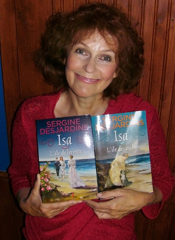

J'ai eu le coup de foudre pour les livres quand, la première fois, j'ai posé
les yeux sur la petite bibliothèque de l'école du Cap-à-la-Baleine où j'ai passé
mon enfance. J'avais quatre ans. Depuis, plusieurs centaines d'écrivains et
d'écrivaines ont grandement enrichi ma vie. D'être devenue à mon tour une
auteure, à l'aube de la cinquantaine, me comble de joie, même si c'est un
travail beaucoup plus exigeant que ne le croient plusieurs. Outre le bonheur de
voir mes oeuvres publiées, j'ai le privilège de recevoir de nombreuses marques
d'affection et d'estime de mes lecteurs et lectrices. Comme l'a écrit
pertinemment Robertine Barry, « ils sont merveilleux de force et d'affection,
ces liens que l'on forme avec des personnes que l'on ne connaît pas. C'est un
des plaisirs de la vie de l'écrivain que de sentir autour de lui ces courants
sympathiques qui le consolent comme autant de génies bienfaisants, mais
invisibles »

Je suis toujours très heureuse de recevoir des courriers électroniques de
mes lecteurs et lectrices. Vous pouvez me joindre à l'adresse suivante : <a
href="MAILTO:serginedesjardins@gmail.com">serginedesjardins@gmail.com</a>. Je
suis aussi sur <a href="http://twitter.com/sergine54" target="_blank">twitter
(sergine54)</a>. Écrivez-moi aussi si vous désirez obtenir un exemplaire dédicacé
de Marie Major. (25$, incluant les frais de poste si vous habitez au Québec).

Marie Major a plusieurs vies : Édité en 2006 par Guy St-Jean éditeur, ce
roman fut réédité en 2008 par ce même éditeur et par Québec/Loisirs ainsi que
par France/Loisirs, en 2010. Il le sera de nouveau en septembre 2012 par Guy
St-Jean dans la collection Focus (édition en gros caractères) et, en 2013, en
format poche par la maison d'édition française Pocket.

Vous pouvez entendre mon entretien avec Joël Le Bigot <a
href="http://www.radio-canada.ca/emissions/samedi_dimanche/2009-2010/chronique.
asp?idChronique=110578" target="_blank">ici.</a>

En 2011, j'ai reçu <a href="http://fr.wikipedia.org/wiki/Prix_Jovette-
Bernier%E2%80%94Ville_de_Rimouski">le prix littéraire Jovette Bernier</a> pour
la biographie de <a href="pub.php#barry">Robertine Barry</a>.

Je suis lauréate du <a
href="http://www.punctumliteraryagency.eu/#!prix-fr/cczd">prix littéraire
international indépendant Marguerite Yourcenar</a> pour mon roman Marie Major
publié en 2006.

